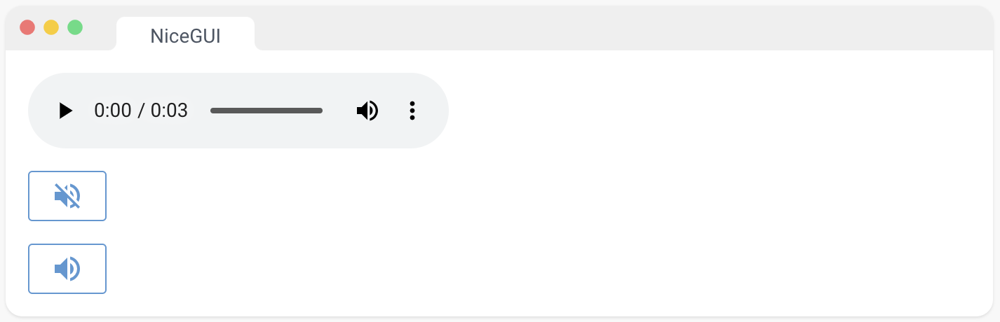
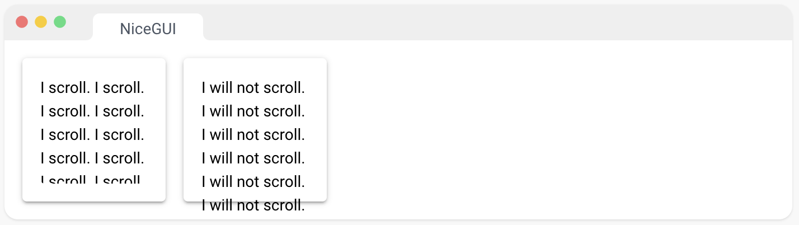

[TOC]


### 一、基础元素

#### 1、标签

显示一些文本。

```python
from nicegui import ui

ui.label('some label')

ui.run()
```


#### 2、图标

此元素基于 Quasar 的 QIcon 组件。

[Material Symbols and Icons - Google Fonts](https://fonts.google.com/icons?icon.set=Material+Icons)，可能的名称参考

```python
from nicegui import ui

ui.icon('thumb_up', color='primary').classes('text-5xl')

ui.run()
```


#### 3、头像

一个包装了 Quasar 的 QAvatar 组件的头像元素。[Avatar | Quasar Framework](https://quasar.dev/vue-components/avatar)

```python
from nicegui import ui

ui.avatar('favorite_border', text_color='grey-11', square=True)
ui.avatar('img:https://nicegui.io/logo_square.png', color='blue-2')

ui.run()
```


#### 4、链接 

创建一个超链接。

要跳转到页面内的特定位置，您可以使用 ui.link_target("name") 放置可链接的锚点，并使用 ui.link(target="#name") 链接到它。

```python
from nicegui import ui

ui.link('NiceGUI on GitHub', 'https://github.com/zauberzeug/nicegui')

ui.run()
```


#### 5、按钮 

此元素基于 Quasar 的 QBtn 组件。[Button | Quasar Framework](https://quasar.dev/vue-components/button)

颜色参数接受 Quasar 颜色、Tailwind 颜色或 CSS 颜色。如果使用 Quasar 颜色，按钮将根据 Quasar 主题进行样式设置，包括文本的颜色。请注意，有些颜色，如"red"，既是 Quasar 颜色又是 CSS 颜色。在这种情况下，将使用 Quasar 颜色。

```python
from nicegui import ui

ui.button('Click me!', on_click=lambda: ui.notify('You clicked me!'))

ui.run()
```


#### 6、徽章

一个包装了 Quasar 的 QBadge 组件的徽章元素。[Badge | Quasar Framework](https://quasar.dev/vue-components/badge)

```python
from nicegui import ui

with ui.button('Click me!', on_click=lambda: badge.set_text(int(badge.text) + 1)):
    badge = ui.badge('0', color='red').props('floating')

ui.run()
```


#### 7、切换 

此元素基于 Quasar 的 QBtnToggle 组件。[Button Toggle | Quasar Framework](https://quasar.dev/vue-components/button-toggle)

选项可以指定为值列表，也可以指定为将值映射到标签的字典。在操纵选项后，请调用 update() 来更新 UI 中的选项。

```python
from nicegui import ui

toggle1 = ui.toggle([1, 2, 3], value=1)
toggle2 = ui.toggle({1: 'A', 2: 'B', 3: 'C'}).bind_value(toggle1, 'value')

ui.run()
```


#### 8、单选选择 

此元素基于 Quasar 的 QRadio 组件。[Radio | Quasar Framework](https://quasar.dev/vue-components/radio)

选项可以指定为值列表，也可以指定为将值映射到标签的字典。在操纵选项后，请调用 update() 来更新 UI 中的选项。

```python
from nicegui import ui

radio1 = ui.radio([1, 2, 3], value=1).props('inline')
radio2 = ui.radio({1: 'A', 2: 'B', 3: 'C'}).props('inline').bind_value(radio1, 'value')

ui.run()
```


#### 9、下拉选择 

此元素基于 Quasar 的 QSelect 组件。[Select | Quasar Framework](https://quasar.dev/vue-components/select)

选项可以指定为值列表，也可以指定为将值映射到标签的字典。在操纵选项后，请调用 update() 来更新 UI 中的选项。

```python
from nicegui import ui

select1 = ui.select([1, 2, 3], value=1)
select2 = ui.select({1: 'One', 2: 'Two', 3: 'Three'}).bind_value(select1, 'value')

ui.run()
```


#### 10、复选框 

此元素基于 Quasar 的 QCheckbox 组件。[Checkbox | Quasar Framework](https://quasar.dev/vue-components/checkbox)

```python
from nicegui import ui

checkbox = ui.checkbox('check me')
ui.label('Check!').bind_visibility_from(checkbox, 'value')

ui.run()
```


#### 11、开关 

此元素基于 Quasar 的 QToggle 组件。[Toggle | Quasar Framework](https://quasar.dev/vue-components/toggle)

```python
from nicegui import ui

switch = ui.switch('switch me')
ui.label('Switch!').bind_visibility_from(switch, 'value')

ui.run()
```


#### 12、滑块 

此元素基于 Quasar 的 QSlider 组件。[Slider | Quasar Framework](https://quasar.dev/vue-components/slider)

```python
from nicegui import ui

slider = ui.slider(min=0, max=100, value=50)
ui.label().bind_text_from(slider, 'value')

ui.run()
```


#### 13、操纵杆 

基于 nipple.js 创建一个操纵杆。[Nipplejs by yoannmoinet](https://yoannmoi.net/nipplejs/)

```python
from nicegui import ui

ui.joystick(color='blue', size=50,
            on_move=lambda e: coordinates.set_text(f"{e.x:.3f}, {e.y:.3f}"),
            on_end=lambda _: coordinates.set_text('0, 0'))
coordinates = ui.label('0, 0')

ui.run()
```


#### 14、文本输入 

此元素基于 Quasar 的 QInput 组件。[Input | Quasar Framework](https://quasar.dev/vue-components/input)

on_change 事件在每次按键时都会被调用，数值会相应地更新。如果您希望等到用户确认输入，您可以注册一个自定义事件回调，例如 ui.input(...).on('keydown.enter', ...) 或 ui.input(...).on('blur', ...)。

您可以使用 validation 参数来定义一组验证规则的字典。第一个失败的规则的键将显示为错误消息。

```python
from nicegui import ui

ui.input(label='Text', placeholder='start typing',
         on_change=lambda e: result.set_text('you typed: ' + e.value),
         validation={'Input too long': lambda value: len(value) < 20})
result = ui.label()

ui.run()
```


#### 15、文本框 

此元素基于 Quasar 的 QInput 组件[Input | Quasar Framework](https://quasar.dev/vue-components/input) 。类型设置为 textarea 以创建多行文本输入。

您可以使用 validation 参数来定义一组验证规则的字典。第一个失败的规则的键将显示为错误消息。"

```python
from nicegui import ui

ui.textarea(label='Text', placeholder='start typing',
            on_change=lambda e: result.set_text('you typed: ' + e.value))
result = ui.label()

ui.run()
```


#### 16、数字输入 

此元素基于 Quasar 的 QInput 组件。[Input | Quasar Framework](https://quasar.dev/vue-components/input)

您可以使用 validation 参数来定义一组验证规则的字典。第一个失败的规则的键将显示为错误消息。

```python
from nicegui import ui

ui.number(label='Number', value=3.1415927, format='%.2f',
          on_change=lambda e: result.set_text(f'you entered: {e.value}'))
result = ui.label()

ui.run()
```


#### 17、旋钮 

此元素基于 Quasar 的 QKnob 组件[Knob | Quasar Framework](https://quasar.dev/vue-components/knob)。该元素用于通过鼠标/触摸滑动从用户获取数字输入。

```python
from nicegui import ui

knob = ui.knob(0.3, show_value=True)

with ui.knob(color='orange', track_color='grey-2').bind_value(knob, 'value'):
    ui.icon('volume_up')

ui.run()
```


#### 18、颜色输入 

此元素扩展了Quasar的QInput组件，具有颜色选择器功能。[Input | Quasar Framework](https://quasar.dev/vue-components/input)

```python
from nicegui import ui

label = ui.label('Change my color!')
ui.color_input(label='Color', value='#000000',
               on_change=lambda e: label.style(f'color:{e.value}'))

ui.run()
```


#### 19、颜色选择器 

此元素基于 Quasar 的 [QMenu | Quasar Framework](https://quasar.dev/vue-components/menu)和 QColor 组件。

```python
from nicegui import ui

with ui.button(icon='colorize') as button:
    ui.color_picker(on_pick=lambda e: button.style(f'background-color:{e.color}!important'))

ui.run()
```


#### 20、日期输入 

此元素基于 Quasar 的 [QDate | Quasar Framework](https://quasar.dev/vue-components/date) 组件。日期是一个字符串，格式由 mask 参数定义。

您还可以使用 range 或 multiple 属性来选择一段日期或多个日期：

ui.date({'from': '2023-01-01', 'to': '2023-01-05'}).props('range') 

ui.date(['2023-01-01', '2023-01-02', '2023-01-03']).props('multiple') 

ui.date([{'from': '2023-01-01', 'to': '2023-01-05'}, '2023-01-07']).props('multiple range')

```python
from nicegui import ui

ui.date(value='2023-01-01', on_change=lambda e: result.set_text(e.value))
result = ui.label()

ui.run()
```


#### 21、时间输入 

此元素基于 Quasar 的 QTime 组件[QDate | Quasar Framework](https://quasar.dev/vue-components/date)。时间是一个字符串，格式由 mask 参数定义。

```python
from nicegui import ui

ui.time(value='12:00', on_change=lambda e: result.set_text(e.value))
result = ui.label()

ui.run()
```


#### 22、文件上传 

基于 Quasar 的 QUploader 组件。[Uploader | Quasar Framework](https://quasar.dev/vue-components/uploader)

```python
from nicegui import ui

ui.upload(on_upload=lambda e: ui.notify(f'Uploaded {e.name}')).classes('max-w-full')

ui.run()
```


#### 23、聊天消息 

基于 Quasar 的 Chat Message 组件。[Chat Message | Quasar Framework](https://quasar.dev/vue-components/chat/)

```python
from nicegui import ui

ui.chat_message('Hello NiceGUI!',
                name='Robot',
                stamp='now',
                avatar='https://robohash.org/ui')

ui.run()
```


#### 24、通用元素 

这个类是所有其他UI元素的基类。但您可以使用它来创建带有任意HTML标签的元素。

```python
from nicegui import ui

with ui.element('div').classes('p-2 bg-blue-100'):
    ui.label('inside a colored div')

ui.run()
```


### 二、标记语言

#### 1、Markdown 元素 

将 Markdown 渲染到页面上。

Markdown 是一种轻量级标记语言，用于排版和格式化文本，常用于撰写文档、博客文章等。

```python
from nicegui import ui

ui.markdown('''This is **Markdown**.''')

ui.run()
```


#### 2、Mermaid 图表 

用 Markdown 类似的 [Mermaid | Diagramming and charting tool](https://mermaid.js.org/) 语言编写的图表和图表的渲染。Mermaid 语法也可以在 Markdown 元素内使用，通过将扩展字符串 'mermaid' 提供给 ui.markdown 元素。

```python
from nicegui import ui

ui.mermaid('''
graph LR;
    A --> B;
    A --> C;
''')

ui.run()
```


#### 3、HTML 元素 

将任意的 HTML 渲染到页面上。可以使用 Tailwind [Tailwind CSS - Rapidly build modern websites without ever leaving your HTML.](https://tailwindcss.com/) 进行样式设置。您还可以使用 ui.add_head_html 将 HTML 代码添加到文档的头部，使用 ui.add_body_html 将其添加到文档的正文部分。

HTML 是一种用于创建网页和网页应用程序的标记语言，它定义了网页的结构和内容，包括文本、图像、超链接等。

```python
from nicegui import ui

ui.html('This is <strong>HTML</strong>.')

ui.run()
```


#### 4、SVG

您可以使用 ui.html 元素添加可伸缩矢量图形（Scalable Vector Graphics，SVG）

```python
from nicegui import ui

content = '''
    <svg viewBox="0 0 200 200" width="100" height="100" xmlns="http://www.w3.org/2000/svg">
    <circle cx="100" cy="100" r="78" fill="#ffde34" stroke="black" stroke-width="3" />
    <circle cx="80" cy="85" r="8" />
    <circle cx="120" cy="85" r="8" />
    <path d="m60,120 C75,150 125,150 140,120" style="fill:none; stroke:black; stroke-width:8; stroke-linecap:round" />
    </svg>'''
ui.html(content)

ui.run()
```


### 三、图片,音频和视频

#### 1、图像 

显示一幅图片。此元素基于 Quasar 的 QImg 组件。[QImg | Quasar Framework](https://quasar.dev/vue-components/img)

```python
from nicegui import ui

ui.image('https://picsum.photos/id/377/640/360')

ui.run()
```


#### 2、标题和叠加 

通过在 ui.image 元素内嵌套元素，您可以创建增强效果。

使用 Quasar classes [QImg | Quasar Framework](https://quasar.dev/vue-components/img) 进行标题的定位和样式设置。要叠加一个 SVG 图形，使 viewBox 与图像的大小完全匹配，并提供100%的宽度/高度以与实际渲染大小相匹配。

```python
from nicegui import ui

with ui.image('https://picsum.photos/id/29/640/360'):
    ui.label('Nice!').classes('absolute-bottom text-subtitle2 text-center')

with ui.image('https://cdn.stocksnap.io/img-thumbs/960w/airplane-sky_DYPWDEEILG.jpg'):
    ui.html('''
        <svg viewBox="0 0 960 638" width="100%" height="100%" xmlns="http://www.w3.org/2000/svg">
        <circle cx="445" cy="300" r="100" fill="none" stroke="red" stroke-width="20" />
        </svg>
    ''').classes('bg-transparent')

ui.run()
```


#### 3、交互式图像 

创建带有处理鼠标事件并提供图像坐标的SVG叠加层的图像。这也是处理图像更新不会闪烁的最佳选择。如果源 URL 的更改速度快于浏览器加载图像的速度，某些图像将被跳过。因此，反复更新图像源将自动适应可用的带宽。请参考OpenCV Webcam获取示例。[nicegui/examples/opencv_webcam/main.py at main · zauberzeug/nicegui (github.com)](https://github.com/zauberzeug/nicegui/blob/main/examples/opencv_webcam/main.py)

```python
from nicegui import ui
from nicegui.events import MouseEventArguments

def mouse_handler(e: MouseEventArguments):
    color = 'SkyBlue' if e.type == 'mousedown' else 'SteelBlue'
    ii.content += f'<circle cx="{e.image_x}" cy="{e.image_y}" r="15" fill="none" stroke="{color}" stroke-width="4" />'
    ui.notify(f'{e.type} at ({e.image_x:.1f}, {e.image_y:.1f})')

src = 'https://picsum.photos/id/565/640/360'
ii = ui.interactive_image(src, on_mouse=mouse_handler, events=['mousedown', 'mouseup'], cross=True)

ui.run()
```


#### 4、音频 

显示一个音频播放器。

请查看此处，以获取可以使用通用事件订阅 on() 进行订阅的事件列表。

https://developer.mozilla.org/en-US/docs/Web/HTML/Element/audio#events

```python
from nicegui import ui

a = ui.audio('https://cdn.pixabay.com/download/audio/2022/02/22/audio_d1718ab41b.mp3')
a.on('ended', lambda _: ui.notify('Audio playback completed'))

ui.button(on_click=lambda: a.props('muted'), icon='volume_off').props('outline')
ui.button(on_click=lambda: a.props(remove='muted'), icon='volume_up').props('outline')

ui.run()
```



#### 5、视频 

显示一个视频。

请查看此处，以获取可以使用通用事件订阅 on() 进行订阅的事件列表。

https://developer.mozilla.org/en-US/docs/Web/HTML/Element/video#events

```python
from nicegui import ui

v = ui.video('https://test-videos.co.uk/vids/bigbuckbunny/mp4/h264/360/Big_Buck_Bunny_360_10s_1MB.mp4')
v.on('ended', lambda _: ui.notify('Video playback completed'))

ui.run()
```


### 四、数据元素

#### 1、表格

一个基于 Quasar 的 QTable 组件的表格。[Table | Quasar Framework](https://quasar.dev/vue-components/table)

如果选择属性设置为 'single' 或 'multiple'，那么可以访问一个包含所选行的 selected 属性。

```python
from nicegui import ui

columns = [
    {'name': 'name', 'label': 'Name', 'field': 'name', 'required': True, 'align': 'left'},
    {'name': 'age', 'label': 'Age', 'field': 'age', 'sortable': True},
]
rows = [
    {'name': 'Alice', 'age': 18},
    {'name': 'Bob', 'age': 21},
    {'name': 'Carol'},
]
ui.table(columns=columns, rows=rows, row_key='name')

ui.run()
```


#### 2、AG Grid (大数据)

使用 AG Grid 创建网格的元素。

可以使用 call_api_method 方法来调用 AG Grid API 方法。

```python
from nicegui import ui

grid = ui.aggrid({
    'defaultColDef': {'flex': 1},
    'columnDefs': [
        {'headerName': 'Name', 'field': 'name'},
        {'headerName': 'Age', 'field': 'age'},
        {'headerName': 'Parent', 'field': 'parent', 'hide': True},
    ],
    'rowData': [
        {'name': 'Alice', 'age': 18, 'parent': 'David'},
        {'name': 'Bob', 'age': 21, 'parent': 'Eve'},
        {'name': 'Carol', 'age': 42, 'parent': 'Frank'},
    ],
    'rowSelection': 'multiple',
}).classes('max-h-40')

def update():
    grid.options['rowData'][0]['age'] += 1
    grid.update()

ui.button('Update', on_click=update)
ui.button('Select all', on_click=lambda: grid.call_api_method('selectAll'))
ui.button('Show parent', on_click=lambda: grid.call_column_api_method('setColumnVisible', 'parent', True))

ui.run()
```


#### 3、图表 

使用 Highcharts [Interactive charting library | Highcharts](https://www.highcharts.com/) 创建图表的元素。可以通过更改选项属性将更新推送到图表。在数据发生变化后，请调用 update 方法来刷新图表。

默认情况下，会创建一个 Highcharts.chart。如果要使用 Highcharts.stockChart 等其他选项，请将 type 属性设置为 "stockChart"。

```python
from nicegui import ui
from random import random

chart = ui.chart({
    'title': False,
    'chart': {'type': 'bar'},
    'xAxis': {'categories': ['A', 'B']},
    'series': [
        {'name': 'Alpha', 'data': [0.1, 0.2]},
        {'name': 'Beta', 'data': [0.3, 0.4]},
    ],
}).classes('w-full h-64')

def update():
    chart.options['series'][0]['data'][0] = random()
    chart.update()

ui.button('Update', on_click=update)

ui.run()
```


#### 4、Apache EChart 

使用 [Apache ECharts](https://echarts.apache.org/zh/index.html) 创建图表的元素。可以通过更改选项属性将更新推送到图表。在数据发生变化后，请调用 update 方法来刷新图表。

```python
from nicegui import ui
from random import random

echart = ui.echart({
    'xAxis': {'type': 'value'},
    'yAxis': {'type': 'category', 'data': ['A', 'B'], 'inverse': True},
    'legend': {'textStyle': {'color': 'gray'}},
    'series': [
        {'type': 'bar', 'name': 'Alpha', 'data': [0.1, 0.2]},
        {'type': 'bar', 'name': 'Beta', 'data': [0.3, 0.4]},
    ],
})

def update():
    echart.options['series'][0]['data'][0] = random()
    echart.update()

ui.button('Update', on_click=update)

ui.run()
```


#### 5、Pyplot 上下文 

创建一个上下文以配置 Matplotlib 绘图。[Matplotlib — Visualization with Python](https://matplotlib.org/)

```python
import numpy as np
from matplotlib import pyplot as plt
from nicegui import ui

with ui.pyplot(figsize=(3, 2)):
    x = np.linspace(0.0, 5.0)
    y = np.cos(2 * np.pi * x) * np.exp(-x)
    plt.plot(x, y, '-')

ui.run()
```


#### 6、线性图 

使用 pyplot 创建一张线性图。当与 ui.timer 结合使用时，push 方法可以提供实时更新。

```python
import math
from datetime import datetime
from nicegui import ui

line_plot = ui.line_plot(n=2, limit=20, figsize=(3, 2), update_every=5) \
    .with_legend(['sin', 'cos'], loc='upper center', ncol=2)

def update_line_plot() -> None:
    now = datetime.now()
    x = now.timestamp()
    y1 = math.sin(x)
    y2 = math.cos(x)
    line_plot.push([now], [[y1], [y2]])

line_updates = ui.timer(0.1, update_line_plot, active=False)
line_checkbox = ui.checkbox('active').bind_value(line_updates, 'active')

ui.run()
```


#### 7、Plotly 元素 

渲染 Plotly 图表。有两种传递 Plotly 图表的方式，详见 figure 参数：

1. 传递 go.Figure 对象，详见 https://plotly.com/python/
2. 传递 Python 字典对象，包含 data、layout 和 config 键（可选），详见 https://plotly.com/javascript/

为获得最佳性能，使用声明性字典方法创建 Plotly 图表。

```python
import plotly.graph_objects as go
from nicegui import ui

fig = go.Figure(go.Scatter(x=[1, 2, 3, 4], y=[1, 2, 3, 2.5]))
fig.update_layout(margin=dict(l=0, r=0, t=0, b=0))
ui.plotly(fig).classes('w-full h-40')

ui.run()
```


#### 8、线性进度条 

一个包装了 Quasar 的 QLinearProgress 组件的线性进度条。[Linear Progress | Quasar Framework](https://quasar.dev/vue-components/linear-progress)

```python
from nicegui import ui

slider = ui.slider(min=0, max=1, step=0.01, value=0.5)
ui.linear_progress().bind_value_from(slider, 'value')

ui.run()
```


#### 9、圆形进度条 

一个包装了 Quasar 的 QCircularProgress 组件的圆形进度条。[Circular Progress | Quasar Framework](https://quasar.dev/vue-components/circular-progress)

```python
from nicegui import ui

slider = ui.slider(min=0, max=1, step=0.01, value=0.5)
ui.circular_progress().bind_value_from(slider, 'value')

ui.run()
```


#### 10、旋转器 

此元素基于 Quasar 的 QSpinner 组件。[Spinners | Quasar Framework](https://quasar.dev/vue-components/spinners)

```python
from nicegui import ui

with ui.row():
    ui.spinner(size='lg')
    ui.spinner('audio', size='lg', color='green')
    ui.spinner('dots', size='lg', color='red')

ui.run()
```


#### 11、3D 场景 

使用 [Three.js – JavaScript 3D Library (threejs.org)](https://threejs.org/) 显示一个3D场景。目前，NiceGUI支持盒子、球体、圆柱/圆锥、挤压体、直线、曲线和纹理网格。对象可以进行平移、旋转，并以不同的颜色、透明度或线框形式显示。它们还可以分组以应用联合运动。

```python
from nicegui import ui

with ui.scene().classes('w-full h-64') as scene:
    scene.sphere().material('#4488ff')
    scene.cylinder(1, 0.5, 2, 20).material('#ff8800', opacity=0.5).move(-2, 1)
    scene.extrusion([[0, 0], [0, 1], [1, 0.5]], 0.1).material('#ff8888').move(-2, -2)

    with scene.group().move(z=2):
        scene.box().move(x=2)
        scene.box().move(y=2).rotate(0.25, 0.5, 0.75)
        scene.box(wireframe=True).material('#888888').move(x=2, y=2)

    scene.line([-4, 0, 0], [-4, 2, 0]).material('#ff0000')
    scene.curve([-4, 0, 0], [-4, -1, 0], [-3, -1, 0], [-3, -2, 0]).material('#008800')

    logo = 'https://avatars.githubusercontent.com/u/2843826'
    scene.texture(logo, [[[0.5, 2, 0], [2.5, 2, 0]],
                         [[0.5, 0, 0], [2.5, 0, 0]]]).move(1, -2)

    teapot = 'https://upload.wikimedia.org/wikipedia/commons/9/93/Utah_teapot_(solid).stl'
    scene.stl(teapot).scale(0.2).move(-3, 4)

    scene.text('2D', 'background: rgba(0, 0, 0, 0.2); border-radius: 5px; padding: 5px').move(z=2)
    scene.text3d('3D', 'background: rgba(0, 0, 0, 0.2); border-radius: 5px; padding: 5px').move(y=-2).scale(.05)

ui.run()
```


#### 12、树状结构 

使用 Quasar 的 QTree 组件显示分层数据。[Tree | Quasar Framework](https://quasar.dev/vue-components/tree)

如果使用ID，请确保它们在整个树中是唯一的。

要使用复选框和 on_tick，将 tick_strategy 参数设置为 "leaf"、"leaf-filtered" 或 "strict"。

```python
from nicegui import ui

ui.tree([
    {'id': 'numbers', 'children': [{'id': '1'}, {'id': '2'}]},
    {'id': 'letters', 'children': [{'id': 'A'}, {'id': 'B'}]},
], label_key='id', on_select=lambda e: ui.notify(e.value))

ui.run()
```


#### 13、日志视图 

创建一个日志视图，允许添加新行而无需重新传输整个历史记录给客户端。

```python
from datetime import datetime
from nicegui import ui

log = ui.log(max_lines=10).classes('w-full h-20')
ui.button('Log time', on_click=lambda: log.push(datetime.now().strftime('%X.%f')[:-5]))

ui.run()
```


#### 14、编辑器 

一个基于 Quasar 的 QEditor [Editor (WYSIWYG) | Quasar Framework](https://quasar.dev/vue-components/editor) 的所见即所得（WYSIWYG）编辑器。value 是一个包含格式化文本的字符串，格式为HTML代码。

```python
from nicegui import ui

editor = ui.editor(placeholder='Type something here')
ui.markdown().bind_content_from(editor, 'value',
                                backward=lambda v: f'HTML code:\n```\n{v}\n```')

ui.run()
```


#### 15、代码 

此元素显示带有语法高亮的代码块。

```python
from nicegui import ui

ui.code('''
    from nicegui import ui

    ui.label('Code inception!')

    ui.run()
''').classes('w-full')

ui.run()
```


#### 16、JSON编辑器 

使用 JSONEditor [josdejong/svelte-jsoneditor: A web-based tool to view, edit, format, repair, query, transform, and validate JSON (github.com)](https://github.com/josdejong/svelte-jsoneditor) 创建 JSON 编辑器的元素。可以通过更改 properties 属性将更新推送到编辑器。在数据发生变化后，请调用 update 方法来刷新编辑器。

```python
from nicegui import ui

json = {
    'array': [1, 2, 3],
    'boolean': True,
    'color': '#82b92c',
    None: None,
    'number': 123,
    'object': {
        'a': 'b',
        'c': 'd',
    },
    'time': 1575599819000,
    'string': 'Hello World',
}
ui.json_editor({'content': {'json': json}},
               on_select=lambda e: ui.notify(f'Select: {e}'),
               on_change=lambda e: ui.notify(f'Change: {e}'))

ui.run()
```


### 五、布局

#### 1、卡片 

此元素基于 Quasar 的 QCard 组件 [Card | Quasar Framework](https://quasar.dev/vue-components/card)。它提供了一个带有投影阴影的容器。

注意：Quasar 组件和此元素之间有细微差异。与此元素不同，原始的 QCard 默认没有填充，并隐藏了嵌套元素的外边框。如果您想要原始的行为，请使用 tight 方法。如果您希望子元素有填充和边框，请将子元素放入另一个容器中。

```python
from nicegui import ui

with ui.card().tight():
    ui.image('https://picsum.photos/id/684/640/360')
    with ui.card_section():
        ui.label('Lorem ipsum dolor sit amet, consectetur adipiscing elit, ...')

ui.run()
```


#### 2、列元素 

提供一个容器，按列排列其子元素。

```python
from nicegui import ui

with ui.column():
    ui.label('label 1')
    ui.label('label 2')
    ui.label('label 3')

ui.run()
```


#### 3、行元素 

提供一个容器，按行排列其子元素。

```python
from nicegui import ui

with ui.row():
    ui.label('label 1')
    ui.label('label 2')
    ui.label('label 3')

ui.run()
```


#### 4、网格元素 

提供一个容器，以网格形式排列其子元素。

```python
from nicegui import ui

with ui.grid(columns=2):
    ui.label('Name:')
    ui.label('Tom')

    ui.label('Age:')
    ui.label('42')

    ui.label('Height:')
    ui.label('1.80m')

ui.run()
```


#### 5、清除容器内容 

要从行、列或卡片容器中删除所有元素，可以调用

container.clear()

或者，您可以通过调用以下方法来移除单个元素：

- container.remove(element: Element), 
- container.remove(index: int)，或
- element.delete()。

```python
from nicegui import ui

container = ui.row()

def add_face():
    with container:
        ui.icon('face')
add_face()

ui.button('Add', on_click=add_face)
ui.button('Remove', on_click=lambda: container.remove(0) if list(container) else None)
ui.button('Clear', on_click=container.clear)

ui.run()
```


#### 6、展开元素 

提供一个可展开的容器，基于 Quasar 的 QExpansionItem 组件。[Expansion Item | Quasar Framework](https://quasar.dev/vue-components/expansion-item)

```python
from nicegui import ui

with ui.expansion('Expand!', icon='work').classes('w-full'):
    ui.label('inside the expansion')

ui.run()
```


#### 7、滚动区域 

通过封装内容以自定义滚动条的方式。该元素公开了Quasar的ScrollArea组件。[Scroll Area | Quasar Framework](https://quasar.dev/vue-components/scroll-area/)

```python
from nicegui import ui

with ui.row():
    with ui.card().classes('w-32 h-32'):
        with ui.scroll_area():
            ui.label('I scroll. ' * 20)
    with ui.card().classes('w-32 h-32'):
        ui.label('I will not scroll. ' * 10)

ui.run()
```



#### 8、分隔符 

此元素基于 Quasar 的 QSeparator 组件。[Separator | Quasar Framework](https://quasar.dev/vue-components/separator)

它用作卡片、菜单和其他组件容器的分隔符，类似于HTML的 <hr> 标签。

```python
from nicegui import ui

ui.label('text above')
ui.separator()
ui.label('text below')

ui.run()
```


#### 9、分割器 

ui.splitter 元素将屏幕空间分为可调整大小的部分，允许您在应用程序中创建灵活且响应式的布局。

基于 Quasar 的 Splitter 组件： [QSplitter | Quasar Framework](https://quasar.dev/vue-components/splitter)

它提供了三个可自定义的插槽，before、after 和 separator，可用于在分割器内嵌入其他元素。

```python
from nicegui import ui

with ui.splitter() as splitter:
    with splitter.before:
        ui.label('This is some content on the left hand side.').classes('mr-2')
    with splitter.after:
        ui.label('This is some content on the right hand side.').classes('ml-2')

ui.run()
```


#### 10、标签页 

元素 ui.tabs、ui.tab、ui.tab_panels 和 ui.tab_panel 与 Quasar 的[Tabs | Quasar Framework](https://quasar.dev/vue-components/tabs)和[Tab Panels | Quasar Framework](https://quasar.dev/vue-components/tab-panels) API 类似。

ui.tabs 创建了标签页的容器，例如，可以放置在 ui.header 中。ui.tab_panels 创建了用于标签面板的容器，其中包含实际内容。每个 ui.tab_panel 与一个 ui.tab 元素相关联。

```python
from nicegui import ui

with ui.tabs().classes('w-full') as tabs:
    one = ui.tab('One')
    two = ui.tab('Two')
with ui.tab_panels(tabs, value=two).classes('w-full'):
    with ui.tab_panel(one):
        ui.label('First tab')
    with ui.tab_panel(two):
        ui.label('Second tab')

ui.run()
```


#### 11、步进器 

此元素表示 Quasar 的 QStepper 组件 [Stepper | Quasar Framework](https://quasar.dev/vue-components/stepper#qstepper-api)。它包含单独的步骤。

为了避免在切换步骤时出现动态元素的问题，此元素使用了Vue的keep-alive组件。如果客户端性能成为问题，可以禁用此功能。

```python
from nicegui import ui

with ui.stepper().props('vertical').classes('w-full') as stepper:
    with ui.step('Preheat'):
        ui.label('Preheat the oven to 350 degrees')
        with ui.stepper_navigation():
            ui.button('Next', on_click=stepper.next)
    with ui.step('Ingredients'):
        ui.label('Mix the ingredients')
        with ui.stepper_navigation():
            ui.button('Next', on_click=stepper.next)
            ui.button('Back', on_click=stepper.previous).props('flat')
    with ui.step('Bake'):
        ui.label('Bake for 20 minutes')
        with ui.stepper_navigation():
            ui.button('Done', on_click=lambda: ui.notify('Yay!', type='positive'))
            ui.button('Back', on_click=stepper.previous).props('flat')

ui.run()
```


#### 12、时间线 

此元素代表了 Quasar 的 QTimeline 组件。[Timeline | Quasar Framework](https://quasar.dev/vue-components/timeline#qtimeline-api)

```python
from nicegui import ui

with ui.timeline(side='right'):
    ui.timeline_entry('Rodja and Falko start working on NiceGUI.',
                      title='Initial commit',
                      subtitle='May 07, 2021')
    ui.timeline_entry('The first PyPI package is released.',
                      title='Release of 0.1',
                      subtitle='May 14, 2021')
    ui.timeline_entry('Large parts are rewritten to remove JustPy '
                      'and to upgrade to Vue 3 and Quasar 2.',
                      title='Release of 1.0',
                      subtitle='December 15, 2022',
                      icon='rocket')

ui.run()
```


#### 13、走马灯 

此元素代表了 Quasar 的 QCarousel 组件 [Carousel | Quasar Framework](https://quasar.dev/vue-components/carousel#qcarousel-api)。它包含个别的走马灯幻灯片。

```python
from nicegui import ui

with ui.carousel(animated=True, arrows=True, navigation=True).props('height=180px'):
    with ui.carousel_slide().classes('p-0'):
        ui.image('https://picsum.photos/id/30/270/180').classes('w-[270px]')
    with ui.carousel_slide().classes('p-0'):
        ui.image('https://picsum.photos/id/31/270/180').classes('w-[270px]')
    with ui.carousel_slide().classes('p-0'):
        ui.image('https://picsum.photos/id/32/270/180').classes('w-[270px]')

ui.run()
```


#### 14、菜单 

基于 Quasar 的 QMenu 组件 [QMenu | Quasar Framework](https://quasar.dev/vue-components/menu) 创建菜单。菜单应放置在应该显示的元素内部。

```python
from nicegui import ui

with ui.row().classes('w-full items-center'):
    result = ui.label().classes('mr-auto')
    with ui.button(icon='menu'):
        with ui.menu() as menu:
            ui.menu_item('Menu item 1', lambda: result.set_text('Selected item 1'))
            ui.menu_item('Menu item 2', lambda: result.set_text('Selected item 2'))
            ui.menu_item('Menu item 3 (keep open)',
                         lambda: result.set_text('Selected item 3'), auto_close=False)
            ui.separator()
            ui.menu_item('Close', on_click=menu.close)

ui.run()
```


#### 15、工具提示 

只需在 UI 元素上调用 tooltip(text:str) 方法即可提供工具提示。

如果需要更多的样式控制，可以嵌套工具提示元素并应用 props、类和样式。

```python
from nicegui import ui

ui.label('Tooltips...').tooltip('...are shown on mouse over')
with ui.button(icon='thumb_up'):
    ui.tooltip('I like this').classes('bg-green')

ui.run()
```


#### 16、通知 

在屏幕上显示通知。

注意：您可以根据 Quasar 的 [Notify | Quasar Framework](https://quasar.dev/quasar-plugins/notify#notify-api)  API 传递附加的关键字参数。

```python
from nicegui import ui

ui.button('Say hi!', on_click=lambda: ui.notify('Hi!', close_button='OK'))

ui.run()
```


#### 17、对话框 

基于 Quasar 的 QDialog 组件 [Dialog | Quasar Framework](https://quasar.dev/vue-components/dialog) 创建对话框。默认情况下，单击或按 ESC 键即可关闭它。要使其保持可见，可以在对话框元素上设置 .props('persistent')。

```python
from nicegui import ui

with ui.dialog() as dialog, ui.card():
    ui.label('Hello world!')
    ui.button('Close', on_click=dialog.close)

ui.button('Open a dialog', on_click=dialog.open)

ui.run()
```


### 六、外观

#### 1、样式 

NiceGUI 使用 [Quasar Framework](https://quasar.dev/) 版本1.0，因此具有其完整的设计能力。每个 NiceGUI 元素都提供了一个 props 方法，其中的内容会传递给 Quasar 组件 [Introduction - JustPy](https://justpy.io/quasar_tutorial/introduction/#props-of-quasar-components)：请查看 Quasar 文档[Button | Quasar Framework](https://quasar.dev/vue-components/button#design) 以了解所有样式 props。具有前置冒号 : 的 props 可包含在客户端上评估的 JavaScript 表达式。您还可以使用 classes 方法应用 Tailwind CSS 实用类 [Tailwind CSS - Rapidly build modern websites without ever leaving your HTML.](https://tailwindcss.com/)。

如果您真的需要应用 CSS 样式，可以使用 styles 方法。这里的分隔符是 ; 而不是空格。

这三个函数还提供了 remove 和 replace 参数，以防特定样式不符合预定义的外观。

```python
from nicegui import ui

ui.radio(['x', 'y', 'z'], value='x').props('inline color=green')
ui.button(icon='touch_app').props('outline round').classes('shadow-lg')
ui.label('Stylish!').style('color: #6E93D6; font-size: 200%; font-weight: 300')

ui.run()
```


#### 2、尝试样式化 NiceGUI 元素！ 

尝试使用 Tailwind CSS 类[Tailwind CSS - Rapidly build modern websites without ever leaving your HTML.](https://tailwindcss.com/)、Quasar 属性[Introduction - JustPy](https://justpy.io/quasar_tutorial/introduction/#props-of-quasar-components)和 CSS 样式来影响 NiceGUI 元素。

请选择一个可用的元素，然后开始对其进行样式化！


#### 3、Tailwind CSS 

[Tailwind CSS - Rapidly build modern websites without ever leaving your HTML.](https://tailwindcss.com/) 是一种用于快速构建自定义用户界面的 CSS 框架。NiceGUI 提供了一个流畅的、支持自动完成的界面，用于向 UI 元素添加 Tailwind 类。

您可以通过导航 tailwind 属性的方法来发现可用的类。建造者模式允许您将多个类链接在一起（如 "Label A" 中所示）。您还可以使用一组类来调用 tailwind 属性（如 "Label B" 中所示）。

尽管这与使用 classes 方法非常相似，但对于Tailwind类而言更为方便，因为它支持自动完成。

最后但并非最不重要的是，您还可以预定义一个样式，并将其应用于多个元素（标签 C 和 D）。

```python
from nicegui import Tailwind, ui

ui.label('Label A').tailwind.font_weight('extrabold').text_color('blue-600').background_color('orange-200')
ui.label('Label B').tailwind('drop-shadow', 'font-bold', 'text-green-600')

red_style = Tailwind().text_color('red-600').font_weight('bold')
label_c = ui.label('Label C')
red_style.apply(label_c)
ui.label('Label D').tailwind(red_style)

ui.run()
```


#### 4、查询选择器 

要操作像文档主体这样的元素，您可以使用 ui.query 函数。通过查询结果，您可以像处理其他 UI 元素一样添加类、样式和属性。这可以用来改变页面的背景颜色，例如：ui.query('body').classes('bg-green')。

```python
from nicegui import ui

def set_background(color: str) -> None:
    ui.query('body').style(f'background-color: {color}')

ui.button('Blue', on_click=lambda: set_background('#ddeeff'))
ui.button('Orange', on_click=lambda: set_background('#ffeedd'))

ui.run()
```


#### 5、颜色主题 

设置 [Quasar Framework](https://quasar.dev/) 使用的主要颜色（主色、次要色、强调色等）。

```python
from nicegui import ui

ui.button('Default', on_click=lambda: ui.colors())
ui.button('Gray', on_click=lambda: ui.colors(primary='#555'))

ui.run()
```


#### 6、暗模式 

您可以使用此元素在页面上启用、禁用或切换暗模式。值 None 表示自动模式，使用客户端的系统首选项。

请注意，此元素会覆盖 ui.run 函数和页面装饰器的 dark 参数。

```python
from nicegui import ui

dark = ui.dark_mode()
ui.label('Switch mode:')
ui.button('Dark', on_click=dark.enable)
ui.button('Light', on_click=dark.disable)

ui.run()
```


