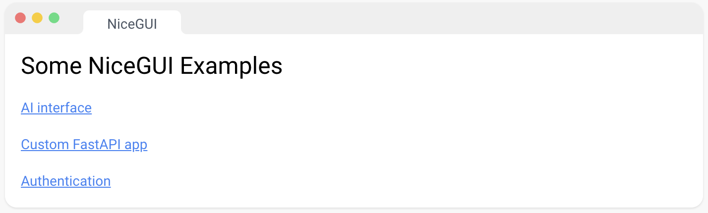
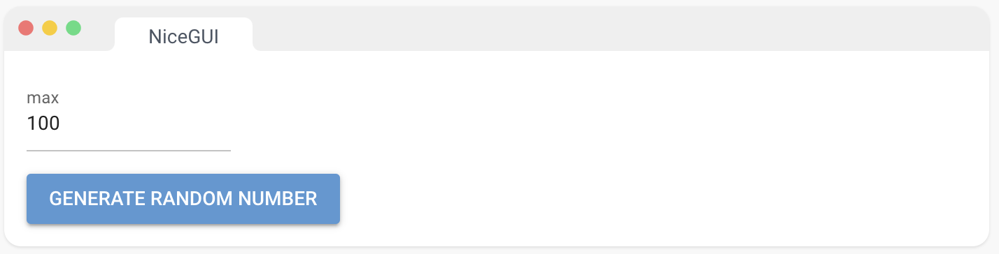
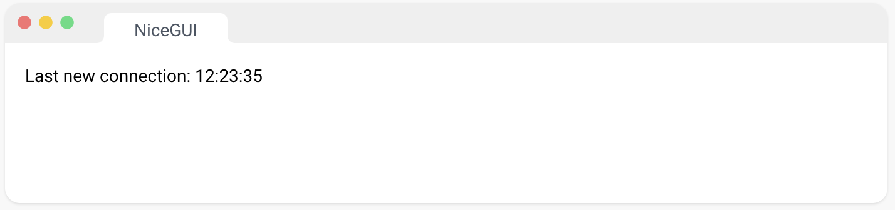
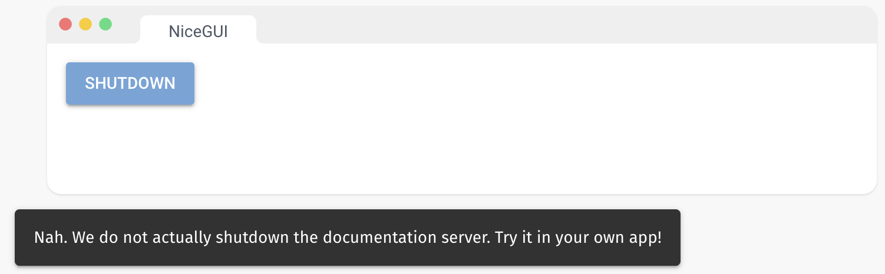
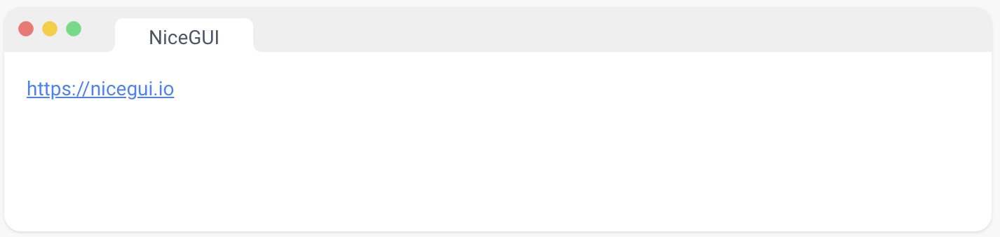
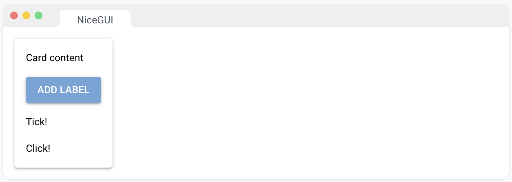
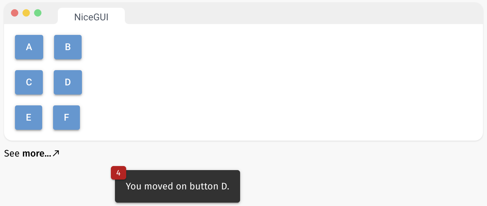
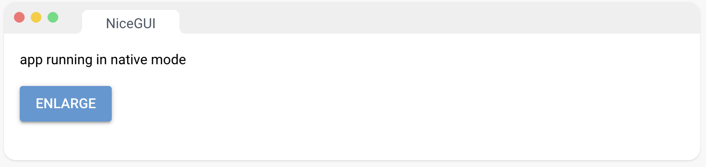
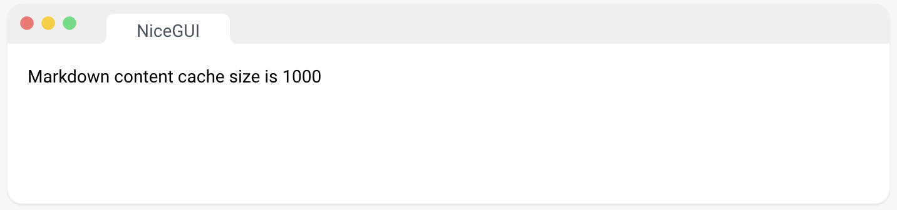

### 九、路由 

#### 1、静态文件 

add_static_files() 使本地目录在指定的端点（例如 '/static'）上可用。这对于向前端提供本地数据，如图像，非常有用。否则，浏览器将无法访问这些文件。只将非关键安全文件放在其中，因为它们对每个人都是可访问的。

要使单个文件可访问，可以使用 add_static_file()。对于应该以流的形式传输的媒体文件，可以使用 add_media_files() 或 add_media_file()。"

url_path： 以斜杠“/”开头的字符串，用于标识应该提供文件的路径

local_directory： 包含要用作静态内容提供的文件的本地文件夹

```python
from nicegui import app, ui

app.add_static_files('/examples', 'examples')
ui.label('Some NiceGUI Examples').classes('text-h5')
ui.link('AI interface', '/examples/ai_interface/main.py')
ui.link('Custom FastAPI app', '/examples/fastapi/main.py')
ui.link('Authentication', '/examples/authentication/main.py')

ui.run()
```



#### 2、媒体文件 

add_media_files() 允许从指定的端点（例如 '/media'）流式传输本地文件。这应该用于支持正确流式传输的媒体文件。否则，浏览器将无法逐渐访问和加载文件，也无法跳转到流中的不同位置。只将非关键安全文件放在其中，因为它们对每个人都是可访问的。

要使单个文件通过流式传输可访问，可以使用 add_media_file()。对于小的静态文件，可以使用 add_static_files() 或 add_static_file()。"

url_path： 以斜杠“/”开头的字符串，用于标识应该提供文件的路径

local_directory： 包含要用作媒体内容提供的文件的本地文件夹

```python
import requests
from nicegui import app, ui
from pathlib import Path

media = Path('media')
media.mkdir(exist_ok=True)
r = requests.get('https://cdn.coverr.co/videos/coverr-cloudy-sky-2765/1080p.mp4')
(media  / 'clouds.mp4').write_bytes(r.content)
app.add_media_files('/my_videos', media)
ui.video('/my_videos/clouds.mp4')

ui.run()
```


#### 3、API 响应 

NiceGUI 基于 FastAPI。这意味着您可以使用 FastAPI 的所有功能。例如，您可以在图形用户界面之外实现 RESTful API。只需从 nicegui 导入 app 对象。或者，您可以在自己的 FastAPI 应用程序之上运行 NiceGUI，而不是使用 ui.run() 自动启动服务器，使用 ui.run_with(app)。

您还可以在页面函数内返回任何其他 FastAPI 响应对象。例如，如果满足某些条件，您可以返回 RedirectResponse 来将用户重定向到另一个页面。这在我们的身份验证演示中有使用。

```python
import random
from nicegui import app, ui

@app.get('/random/{max}')
def generate_random_number(max: int):
    return {'min': 0, 'max': max, 'value': random.randint(0, max)}

max = ui.number('max', value=100)
ui.button('generate random number', on_click=lambda: ui.open(f'/random/{max.value:.0f}'))

ui.run()
```



### 十、生命周期

#### 1、事件 

您可以注册协程或函数来处理以下事件：

- app.on_startup：在 NiceGUI 启动或重新启动时调用 
- app.on_shutdown：在 NiceGUI 关闭或重新启动时调用 
- app.on_connect：在每个连接的客户端上调用（可选参数：nicegui.Client） 
- app.on_disconnect：在每个断开连接的客户端上调用（可选参数：nicegui.Client） 
- app.on_exception：在发生异常时调用（可选参数：异常） 

当 NiceGUI 关闭或重新启动时，仍在执行中的所有任务将自动取消。

```python
from datetime import datetime
from nicegui import app, ui

dt = datetime.now()

def handle_connection():
    global dt
    dt = datetime.now()
app.on_connect(handle_connection)

label = ui.label()
ui.timer(1, lambda: label.set_text(f'Last new connection: {dt:%H:%M:%S}'))

ui.run()
```



#### 2、关闭 

这将以编程方式停止服务器。仅在自动重载被禁用时才可能。

```python
from nicegui import app, ui

ui.button('shutdown', on_click=app.shutdown)

ui.run(reload=False)
```



#### 3、URL 

您可以通过 app.urls 访问 NiceGUI 应用程序可用的所有 URL 列表。URL 在 app.on_startup 中不可用，因为服务器尚未运行。相反，您可以在页面函数中访问它们，或者使用 app.urls.on_change 注册回调函数。

```python
from nicegui import app, ui

@ui.page('/')
def index():
    for url in app.urls:
        ui.link(url, target=url)

ui.run()
```



### 十一、NiceGUI 基本概念

#### 1、自动上下文 

为了允许编写直观的 UI 描述，NiceGUI 自动跟踪元素创建的上下文。这意味着不需要显式的 parent 参数。而是使用 with 语句定义父上下文。它还传递给事件处理程序和计时器。

在演示中，将标签“Card content”添加到卡片中。由于 ui.button 也添加到卡片中，标签“Click!” 也将在此上下文中创建。标签“Tick!”，在一秒后添加一次，也会添加到卡片中。

这个设计决策使得可以轻松创建模块化组件，即使在 UI 中移动它们，它们仍然可以正常工作。例如，可以将标签和按钮移到其他地方，可能将它们包装在另一个容器中，代码仍然可以正常工作。

```python
from nicegui import ui

with ui.card():
    ui.label('Card content')
    ui.button('Add label', on_click=lambda: ui.label('Click!'))
    ui.timer(1.0, lambda: ui.label('Tick!'), once=True)

ui.run()
```



#### 2、通用事件 

大多数 UI 元素都带有预定义的事件。例如，像演示中的 ui.button “A” 有一个 on_click 参数，它期望一个协程或函数。但是您也可以使用 on 方法来注册一个通用事件处理程序，就像 “B” 那样。这允许您注册任何 JavaScript 和 Quasar 支持的事件处理程序。

例如，您可以为像 “C” 那样的 mousemove 事件注册一个处理程序，即使 ui.button 没有 on_mousemove 参数。有些事件，如 mousemove，会非常频繁地触发。为了避免性能问题，您可以使用 throttle 参数，只有在每 throttle 秒时才调用处理程序（“D”）。

通用事件处理程序可以是同步的或异步的，可选地接受 GenericEventArguments 作为参数（“E”）。您还可以指定应将 JavaScript 或 Quasar 事件的哪些属性传递给处理程序（“F”）。这可以减少需要在服务器和客户端之间传输的数据量。

在这里，您可以找到更多关于支持的事件的信息：

[HTMLElement - Web APIs | MDN (mozilla.org)](https://developer.mozilla.org/en-US/docs/Web/API/HTMLElement#events) 用于 HTML 元素

[Quasar Components | Quasar Framework](https://quasar.dev/components) 用于 Quasar 元素（请参见每个组件页面上的"事件"选项卡）

```python
from nicegui import ui

with ui.row():
    ui.button('A', on_click=lambda: ui.notify('You clicked the button A.'))
    ui.button('B').on('click', lambda: ui.notify('You clicked the button B.'))
with ui.row():
    ui.button('C').on('mousemove', lambda: ui.notify('You moved on button C.'))
    ui.button('D').on('mousemove', lambda: ui.notify('You moved on button D.'), throttle=0.5)
with ui.row():
    ui.button('E').on('mousedown', lambda e: ui.notify(e))
    ui.button('F').on('mousedown', lambda e: ui.notify(e), ['ctrlKey', 'shiftKey'])

ui.run()
```



### 十二、配置

#### 1、ui.run

您可以调用 ui.run() 并提供可选参数：

```python
from nicegui import ui

ui.label('page with custom title')

ui.run(title='My App')
```


#### 2、本机模式

您可以通过在 ui.run 函数中指定 native=True 来启用 NiceGUI 的本机模式。要自定义初始窗口大小和显示模式，请分别使用 window_size 和 fullscreen 参数。此外，您可以通过 app.native.window_args 和 app.native.start_args 提供额外的关键字参数。选择由内部使用的 pywebview 模块 [API | pywebview (flowrl.com)](https://pywebview.flowrl.com/guide/api.html) 为 webview.create_window 和 webview.start 函数定义的任何参数。请注意，这些关键字参数将优先于 ui.run 中定义的参数。

在本机模式中，app.native.main_window 对象允许您访问底层窗口。它是 pywebview 中 Window 的异步版本 [API | pywebview (flowrl.com)](https://pywebview.flowrl.com/guide/api.html#screen-width) 。

```python
from nicegui import app, ui

app.native.window_args['resizable'] = False
app.native.start_args['debug'] = True

ui.label('app running in native mode')
ui.button('enlarge', on_click=lambda: app.native.main_window.resize(1000, 700))

ui.run(native=True, window_size=(400, 300), fullscreen=False)
```



如果 webview 难以找到所需的库，您可能会遇到与 "WebView2Loader.dll" 相关的错误。要解决此问题，请尝试将 DLL 文件移动到上一级目录，例如：

- 从 .venv/Lib/site-packages/webview/lib/x64/WebView2Loader.dll 
- 到 .venv/Lib/site-packages/webview/lib/WebView2Loader.dll

#### 3、环境变量

您可以设置以下环境变量来配置 NiceGUI：

- MATPLOTLIB（默认值：true）可以设置为 false 以避免导入 Matplotlib，从而使 ui.pyplot 和 ui.line_plot 不可用。
- NICEGUI_STORAGE_PATH（默认值：本地 ".nicegui"）可以设置以更改存储文件的位置。
- MARKDOWN_CONTENT_CACHE_SIZE（默认值：1000）：内存中缓存的最大 Markdown 内容片段数。
- NO_NETIFACES（默认值：false）：可以设置为 true 以隐藏 netifaces 的启动警告（例如在 Docker 容器中）。

```python
from nicegui import ui
from nicegui.elements import markdown

ui.label(f'Markdown content cache size is {markdown.prepare_content.cache_info().maxsize}')

ui.run()
```



### 十三、部署

#### 1、服务器托管 

要在服务器上部署您的 NiceGUI 应用程序，您需要在云基础设施上执行您的 main.py（或包含您的 ui.run(...) 的任何包含该命令的文件）。例如，您可以通过 pip 安装 NiceGUI Python 包 [nicegui · PyPI](https://pypi.org/project/nicegui/)，然后使用 systemd 或类似的服务来启动主脚本。在大多数情况下，您可以使用 ui.run 命令将端口设置为 80（或者如果您想使用 HTTPS，则为 443），以便从外部轻松访问。

一个方便的替代方法是使用我们预构建的多架构 Docker 镜像 [zauberzeug/nicegui - Docker Image | Docker Hub](https://hub.docker.com/r/zauberzeug/nicegui)，该镜像包含所有必要的依赖项。使用以下命令，您可以在公共端口 80 上启动当前目录中的 main.py 脚本：

```bash
docker run -it --restart always \
  -p 80:8080 \
  -e PUID=$(id -u) \
  -e PGID=$(id -g) \
  -v $(pwd)/:/app/ \
  zauberzeug/nicegui:latest
```

该演示假定 main.py 在 ui.run 命令中使用默认的端口 8080。-d 告诉 Docker 在后台运行，--restart always 会确保容器在应用程序崩溃或服务器重新启动时重新启动。当然，您也可以将此配置写入 Docker Compose 文件中：

```yaml
app:
    image: zauberzeug/nicegui:latest
    restart: always
    ports:
        - 80:8080
    environment:
        - PUID=1000 # change this to your user id
        - PGID=1000 # change this to your group id
    volumes:
        - ./:/app/
```

Docker 镜像还具有其他实用功能，如非 root 用户执行和信号传递。有关更多详细信息，建议查看我们的 Docker 示例。[nicegui/examples/docker_image at main · zauberzeug/nicegui (github.com)](https://github.com/zauberzeug/nicegui/tree/main/examples/docker_image)

您可以直接使用 FastAPI [About HTTPS - FastAPI (tiangolo.com)](https://fastapi.tiangolo.com/deployment/https/)  提供 SSL 证书。在生产环境中，我们还喜欢使用反向代理，如 Traefik [Traefik Proxy Documentation - Traefik](https://doc.traefik.io/traefik/)  或 NGINX [Advanced Load Balancer, Web Server, & Reverse Proxy - NGINX](https://www.nginx.com/)，来处理这些详细信息。可以查看我们的开发 docker-compose.yml 作为示例[nicegui/docker-compose.yml at main · zauberzeug/nicegui (github.com)](https://github.com/zauberzeug/nicegui/blob/main/docker-compose.yml)。

您还可以查看我们的示例 [nicegui/examples/fastapi at main · zauberzeug/nicegui (github.com)](https://github.com/zauberzeug/nicegui/tree/main/examples/fastapi)，了解如何使用自定义 FastAPI 应用程序。这将使您能够执行 FastAPI 文档 [Deployment - FastAPI (tiangolo.com)](https://fastapi.tiangolo.com/deployment/) 中描述的非常灵活的部署。请注意，要允许多个工作进程，需要执行其他步骤。

#### 2、安装包

NiceGUI 应用程序还可以使用 PyInstaller [PyInstaller Manual — PyInstaller 6.1.0 documentation](https://pyinstaller.org/en/stable/) 打包成可执行文件。这样，您可以将您的应用程序分发为一个可以在任何计算机上执行的单个文件。

只需确保您的 ui.run 命令没有使用 reload 参数。运行下面的 build.py 将在 dist 文件夹中创建一个名为 myapp 的可执行文件：

main.py

```python
from nicegui import native_mode, ui

ui.label('Hello from PyInstaller')

ui.run(reload=False, port=native_mode.find_open_port())
```

build.py

```python
import os
import subprocess
from pathlib import Path
import nicegui

cmd = [
    'python',
    '-m', 'PyInstaller',
    'main.py', # your main file with ui.run()
    '--name', 'myapp', # name of your app
    '--onefile',
    #'--windowed', # prevent console appearing, only use with ui.run(native=True, ...)
    '--add-data', f'{Path(nicegui.__file__).parent}{os.pathsep}nicegui'
]
subprocess.call(cmd)
```

打包提示

- 构建 PyInstaller 应用程序时，主要脚本可以使用本地窗口（而不是浏览器窗口），方法是使用 ui.run(reload=False, native=True)。native 参数可以是 True 或 False，具体取决于您是否想要本地窗口或在用户的浏览器中启动页面 - 两者在 PyInstaller 生成的应用程序中都可以工作。
- 指定 --windowed 给 PyInstaller 将阻止终端控制台出现。然而，只有在您的 ui.run 命令中还指定了 native=True 选项时，才应使用此选项。如果没有终端控制台，用户将无法通过按 Ctrl-C 来退出应用程序。使用 native=True 选项时，应用程序将在窗口关闭时自动关闭，这是预期的行为。
- 指定 --windowed 给 PyInstaller 将在 Mac 上创建一个 .app 文件，可能更方便分发。当您双击该应用程序以运行它时，它将不显示任何控制台输出。您也可以从命令行中运行应用程序 ./myapp.app/Contents/MacOS/myapp 以查看控制台输出。
- 指定 --onefile 给 PyInstaller 将创建一个单独的可执行文件。虽然方便分发，但启动速度会较慢。这不是 NiceGUI 的问题，而只是 PyInstaller 将文件压缩到单个文件中，然后在运行之前将所有文件解压到临时目录的方式。您可以通过从 PyInstaller 命令中删除 --onefile 并自己压缩生成的 dist 目录来缓解这个问题，并将其分发给您的最终用户。最终用户可以解压一次，然后立即开始，而不需要由于 --onefile 标志的不断文件扩展。
- 不同选项的用户体验总结：

| PyInstaller            | ui.run(...)  | 解释                                                         |
| ---------------------- | ------------ | ------------------------------------------------------------ |
| onefile                | native=False | 生成一个单一的可执行文件，位于 dist/ 目录中，以浏览器方式运行 |
| onefile                | native=True  | 生成一个单一的可执行文件，位于 dist/ 目录中，以弹出窗口方式运行 |
| onefile` and `windowed | native=True  | 生成一个单一的可执行文件，位于 dist/（在Mac上，会生成一个带图标的dist/myapp.app文件），运行在弹出式窗口中，不会显示控制台 |
| onefile` and `windowed | native=False | 避免（无法退出应用程序的方式）                               |
| 不指定                 |              | 创建 dist/myapp 目录，可以手动压缩并分发；使用 dist/myapp/myapp 运行 |

- 如果你正在使用 Python 虚拟环境，请确保在虚拟环境中使用 `pip install pyinstaller`，以确保使用正确的 PyInstaller 版本，否则可能会出现应用程序无法正常工作的问题，因为选择了错误版本的 PyInstaller。这就是为什么构建脚本使用 `python -m PyInstaller` 来调用 PyInstaller，而不是仅仅使用 `pyinstaller`。

```bash
python -m venv venv
source venv/bin/activate
pip install nicegui
pip install pyinstaller
```

注意：如果你遇到 "TypeError: a bytes-like object is required, not 'str'" 错误，请尝试在你的 `main.py` 文件的顶部添加以下几行代码：

```python
import sys
sys.stdout = open('logs.txt', 'w')
```

See https://github.com/zauberzeug/nicegui/issues/681 for more information.

#### 3、NiceGUI On Air

使用 `ui.run(on_air=True)` 可以在互联网上与其他人共享你的本地应用程序 🧞。

访问 on-air URL 时，所有库（如 Vue、Quasar 等）都从我们的 CDN 加载。因此，只需传输你的本地应用程序的原始内容和事件。这使得即使你的应用程序只有较差的互联网连接（例如，现场的移动机器人），它仍然可以运行得非常快速。

通过设置 `on_air=True`，你将获得一个有效期为1小时的随机URL。如果你在 [https://on-air.nicegui.io](https://on-air.nicegui.io/) 注册，你将获得一个标识你的设备的令牌，可以用来设置 `ui.run(on_air='<你的令牌>')`，这将为你提供一个固定的URL，并允许你使用密码保护远程访问。

当前 On Air 作为技术预览版本免费使用（暂时）。我们将逐渐提高稳定性，引入付款选项，并扩展服务以支持多设备管理、远程终端访问等。请在 GitHub [zauberzeug/nicegui · Discussions · GitHub](https://github.com/zauberzeug/nicegui/discussions)、Reddit [NiceGUI (reddit.com)](https://www.reddit.com/r/nicegui/) 或 Discord [Discord](https://discord.com/invite/TEpFeAaF4f) 上告诉我们您的反馈。

数据隐私：我们非常重视您的隐私。NiceGUI On Air 不会记录或存储中继数据的任何内容。

